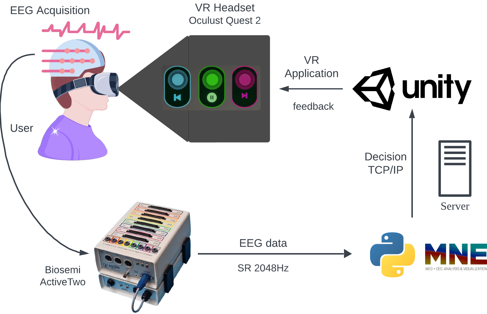

# Asynchronous High-Frequency SSVEP Brain-Computer Interface in Virtual Reality 

This repository contains a collection of tools for analyzing and classifying Steady-State Visual Evoked Potential (SSVEP) Brain-Computer Interfaces (BCI) with high-frequency stimuli. It includes code for classification using Filter Bank Canonical Correlation Analysis (FBCCA) with filters specifically designed for frequencies in the 30 Hz and higher range.

Key features:
- SSVEP analysis tools for high-frequency stimuli
- FBCCA classification implementation
- Custom filter designs for 30+ Hz frequencies
- EEG data processing utilities





---

## Installation

### Prerequisites
Ensure the following are installed:
- Python 3.8 or later
- pip (Python package manager)
- Required hardware:
  - **EEG System**: BioSemi ActiveTwo or compatible device

### Steps

1. Clone the repository:
   ```bash
   git clone https://github.com/jiapulidoar/HF-SSVEP
   cd ssvep-bci

2. Set up a virtual environment (optional but recommended):

   ```bash
   python -m venv env
   source env/bin/activate  # On Windows: env\Scripts\activate
3. Install the required Python packages:

   ```bash
   pip install -r requirements.txt

## Usage 

1. Setup BioSemi ActiveTwo and start TCP server in port `8888` and sampling rate 512Hz.

2. Online Experiment: Configure the system settings in `eegtools\config.py` and run: 

   ```bash
   python eegtools\onlineReceiveData.pyeegtools\config.py

3. 